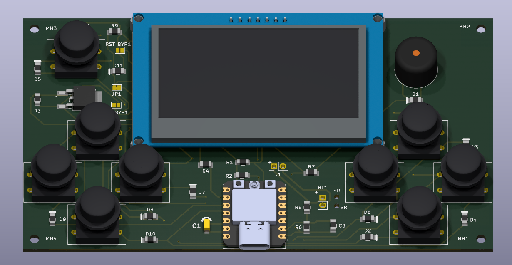
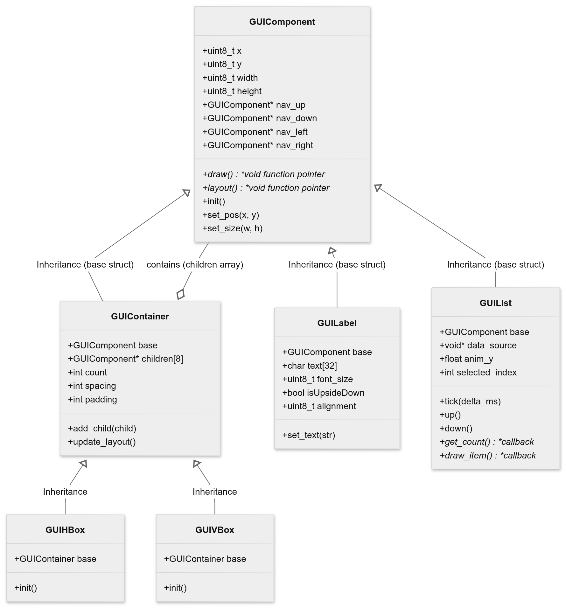
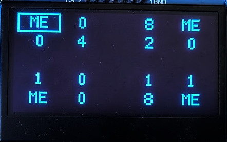
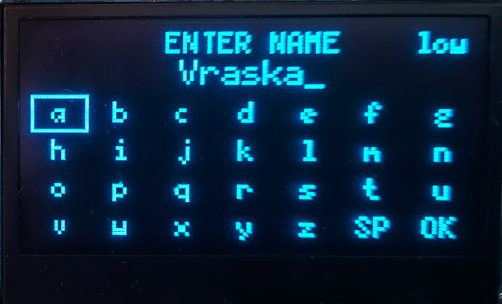

# An electronic ESP32-C3-powered life counter for Trading Card Games. 
## Made in mind with the players of Magic the Gathering and Yu-Gi-Oh.

A 3D render generated in Kicad

# Hardware
The main components of the device are:
1. [SEEED XIAO ESP32-C3](https://botland.store/esp32-wifi-and-bt-modules/22878-seeed-xiao-esp32-s3-wifibluetooth-seeedstudio-113991114.html)
2. [msalamon SSD1309 2.42" OLED display](https://sklep.msalamon.pl/produkt/wyswietlacz-oled-242-128x64px-niebieski/)
3. [A 3x3 12x12mm tactile switch matrix](https://www.tme.eu/pl/en/details/ts24n/microswitches-tact/knitter-switch/ts-24-n/)
4. A passive buzzer
5. 10x 1N4148 diodes
6. A 1050mAh LiPo battery

# Software
When I made the project I used three main components:
  1. ESP-IDF
  2. [u8g2](https://github.com/olikraus/u8g2)
  3. [u8g2-hal-esp-idf](https://github.com/mkfrey/u8g2-hal-esp-idf)

# GUIFramework

When designing this device I expected I would need a way to easily design a UI.
I decided to go with a grid-like system using Labels nexted in VBoxes and HBoxes.
For an easier time programming I added tried to emulate inheritance and OOP in C using vtables.

Later on, I added a GUIList component that uses the delegate design pattern to access the underlying data.
commander_view
 

Using nested containers I was able to get perfectly even grids in my UI without too many manual adjustements.

