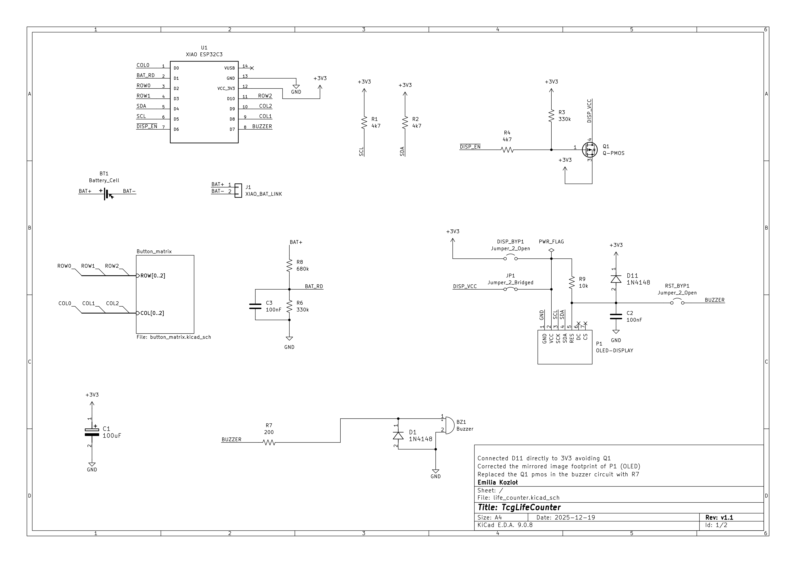
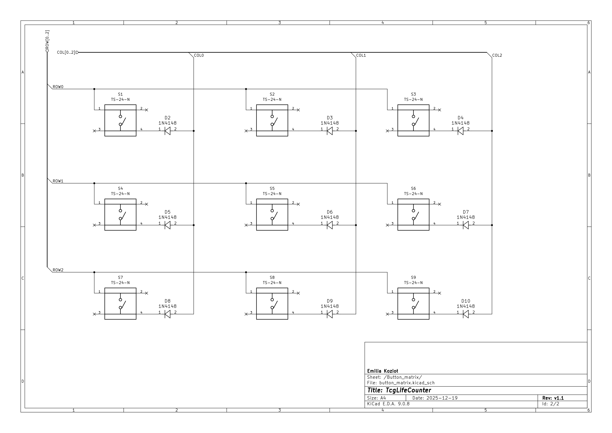

# An electronic ESP32-C3-powered life counter for Trading Card Games. 
## Made with the players of Magic the Gathering and Yu-Gi-Oh in mind.

The main goal for this project was to implement the basic LifeTap features.
I expanded on some of the features by tracking more variables 
(letting the player rename the value names as they see fit).

Anticipating players making mistakes, the device tracks change history 
letting the player undo to a selected point in time.

A 3D render generated in Kicad

# Hardware
The main components of the device are:
1. [SEEED XIAO ESP32-C3](https://botland.store/esp32-wifi-and-bt-modules/22878-seeed-xiao-esp32-s3-wifibluetooth-seeedstudio-113991114.html)
2. [msalamon SSD1309 2.42" OLED display](https://sklep.msalamon.pl/produkt/wyswietlacz-oled-242-128x64px-niebieski/)
3. [A 3x3 12x12mm tactile switch matrix](https://www.tme.eu/pl/en/details/ts24n/microswitches-tact/knitter-switch/ts-24-n/)
4. A passive buzzer
5. 10x 1N4148 diodes
6. A 1050mAh LiPo battery

## The schematics

# Software
When I made the project I used three main components:
1. ESP-IDF
2. [u8g2](https://github.com/olikraus/u8g2)
3. [u8g2-hal-esp-idf](https://github.com/mkfrey/u8g2-hal-esp-idf)

## GUIFramework

When designing this device I expected I would need a way to easily design a UI.
I decided to go with a grid-like system using Labels nested in VBoxes and HBoxes.
For an easier time programming I tried to emulate inheritance and OOP in C using vtables.

Later on, I added a GUIList component that uses the delegate design pattern to access the underlying data.

 

Using nested containers I was able to get perfectly even grids in my UI without too many manual adjustements.
The navigation pointers inside the GUIComponent made designing the UI navigation really easy.
For extra simplicity I added GUI_LINK_VERTICAL and GUI_LINK_HORIZONTAL macros that automatically assign the pointers.

# About the firmware
## The features
For a better user experience I included a few extra features:
1. Battery level tracking (using ADC and a simple linear interpolation).
2. Automatic, adjustible screen shut-off to save battery life.
3. Automatic, adjustible power-off (deep sleep) under extended inactivity.
4. Long press of any of the switches reads as multiple presses, going into turbo mode when held for over 1.2s.

## The non-volatile storage
I used NVS to store data between sessions:
1. Device settings
2. Player names
3. Value names

## FreeRTOS
I went with a modular deisgn based on FreeRTOS tasks for easy concurrency handling.
The main tasks include:
1. The main loop that handles rendering and input handling
2. The keypad task that scans the key matrix every 5 ms
3. The battery level read task that reads the battery level every 1 s
4. The audio manager task that uses a non-blocking queue for audio playback

In the development stage I used a command line task to emulate keypad input
that I really don't use anymore but I left it in the code
just in case I have a use for it in the future.

## The buzzer
The buzzer was added so the device has audible feedback on stuff like errors and device waking up.
I control it using the LEDC library of ESP-IDF to play simple tones.

## The key matrix
To save GPIO pins I went with a 3x3 switch matrix. I run a FreeRTOS task that scans the matrix every 5 ms.
For debouncing I use 8 bit unsigned integers as shift registers. When the last three bits of the register are 1's
the matrix reads a press. Similarly, when the last 3 bits of the register are 0's the matrix reads a release.

**In this prototype I have not yet introduced a way to permanently save game state between sessions**
